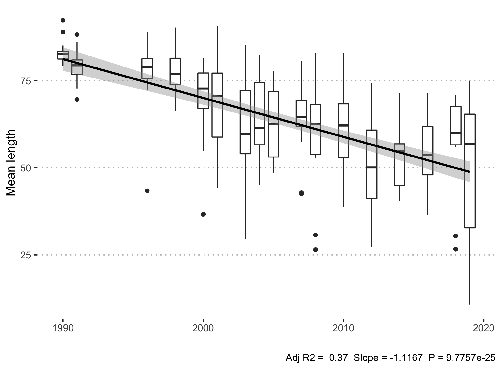
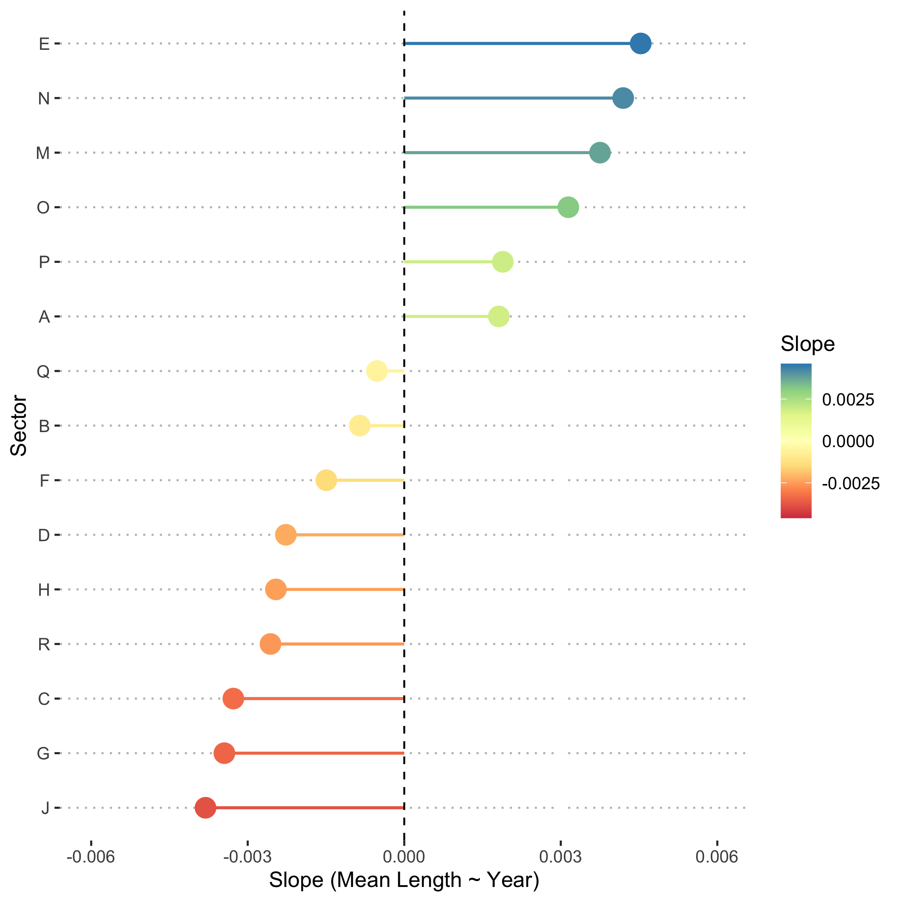
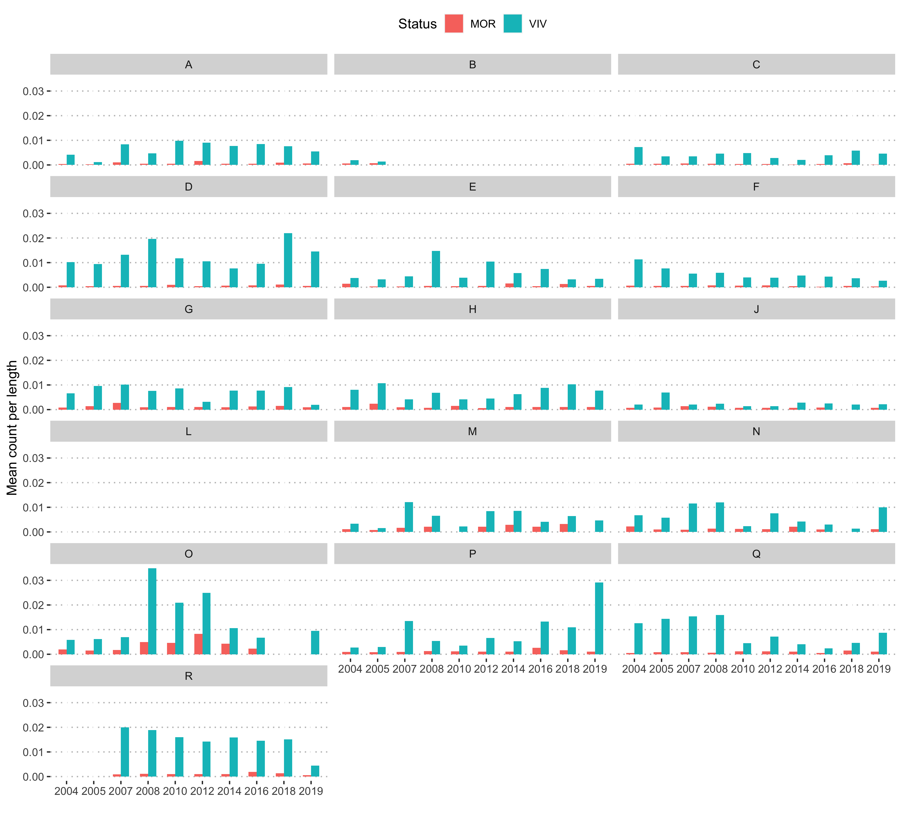

```{r setup, include=FALSE}
knitr::opts_chunk$set(echo = TRUE)

library(ggplot2)
library(readr)
library(dplyr)
library(tidyr)
library(DLMtool)  
theme_set(ggpubr::theme_pubclean())
```

# Context

## Scallops fishery

Two scallop species are fished commercially in the Gulf of St. Lawrence: the Sea Scallop (*Placopecten magellanicus*) and the Iceland Scallop (*Chlamys islandica*) [@stockass]. Fishing is regulated by a fishing season, and or a limited number of fishing days [@stockass]. Every three years, the scallop stock is assessed to evaluate its status, and to verify whether the management plan and conservation approach need to be adjusted to maintain the resource [@stockass]. This assessment is based on landings, fishing effort, catch per unit effort, size structure, weight of muscle landed and density index from scientific surveys [@stockass].

The scallop fishery is data-limited in the Gulf of St. Lawrence, meaning there is not enough data to conduct a conventional stock assessment. This is where the Data-Limited Methods Toolkit (`DLMtool`) comes into play.

## `DLMtool`

The Data-Limited Methods Toolkit ([`DLMtool`](https://www.datalimitedtoolkit.org/)) is an R package that was conceived to address a widespread problem in fisheries management: conventional stock assessments require a lot of data that is not available for as many as 90% of the world's fish populations [@Costello517]. Using object-oriented programming and parallel computing, `DLMtool` models data-limited fisheries under a variety of management strategies that can easily be compared and visualized according to the available information [@DLMtool]. This allows managers to simulate a variety of management scenarios with an evaluation of uncertainty, of the trade-off between how management procedures benefit catch or population stability, and of the potential need to collect additional data. The result is a powerful simulation and diagnostics tool that synthesizes scenarios of over 114 management procedures to inform management recommendations in a transparent way [@DLMtool]. What began as a collaboration between the University of British Columbia's (UBC) Institute for Oceans and Fisheries and the Natural Resources Defense Council (NRDC) has now been used in over 25 fisheries by Fisheries and Oceans Canada, by the National Marine Fisheries Service in the U.S. Mid-Atlantic and Caribbean regions, and by the California Department of Fish & Wildlife, among others [@DLMtool].

## Objectives

The internship's main objective is to learn and apply the Data-Limited Methods Toolkit to evaluate scallop stocks. The first objective was to learn the toolkit and describe the main findings in the current report, with the option to a method with high performance to model scallop stocks if time permits. Though time did not permit me to go in much depth with this, I was able to construct some of the objects used in the DLM toolkit workflow to eventually evaluate stocks with greater accuracy and precision. In this report, I will begin by outlining some general trends in scallop catches, length structures, and mortality rates, before describing how I built objects with these datasets using `DLMtool`. All scripts to generate the figures and results shown in this report are accessible here: [github.com/katherinehebert/DFO-scallops](https://github.com/katherinehebert/DFO-scallops).

------------------------------------------------------------------------

# Exploring trends

Before using `DLMtool`, I first explored the time series in the data provided to me to better understand the system. I first looked at catch data, which contained information about the biomass of the scallop catch per year in each surveyed zone, as well as the effort applied to the catch. After exploring the annual catch trend, I added length-at-capture data to look into the size structure of the catch, which would give insight into the population's structure. I also introduced mortality data into these explorations, to determine how scallop mortality varied (or not) over the sampled period, which would give additional insight into the population's status.

## Catch

First, I explored the commercial fishery dataset which contained Catches per Unit Effort (CPUE), and data describing the Effort, biomass fished (i.e. Landings), and other information describing each event such as date and location variables. These time series are plotted in Figures 1a and 1b. Though the Survey CPUE time series shows relative stability through time in terms of mean CPUE, there is some variability in the variance in CPUE across sectors, with particularly high variance in the years 2018, 1999, and 1996 (Figure 1a).

Then, I fit a simple linear model to each time series to determine an overall trend through time for each measure (Figure 1c and 1d). While CPUE has remained relatively stable since 1987 (Figure 1c), landings have been steadily decreasing at a rate of -29.39 **tons per year????** since 1987 despite a large increase before 1990 (Figure 1d).


Though an overview of the whole time series is very helpful to gain an understanding of the broader context of the fishery and how it has been managed, a closer look at recent trends is helpful to evaluate the current status of the fishery (Figure 2). If we "zoom in" to the most recent 5 years, we get a slightly different picture of the Survey CPUE and Landings trends shown above. Notably, we can see that an average increase in Survey CPUE in 2018 (Figures 2a and 2c) was followed by a decrease in landings between 2018 and 2019 (Figures 2b and 2d).


Both plots and analyses in Figures 1 and 2 were adapted from @refpoint [github.com/MathBoud/DLM.ReferencePoint](https://github.com/MathBoud/DLM.ReferencePoint). The code to reproduce these figures **is in the script \_\_\_\_ in the repo \_\_\_\_\_\_\_\_\_**.

## Length

Though the overall trend is informative, I also had access to a survey of scallop length frequencies through time, which offer insight into the Gulf population's structure that is not accessible in the overall catch and landings time series explored above. 

  First, I took the weighted mean of scallop length per year, where the weights were the counts of scallops in each length category. As such, the weighted mean represents the mean length of the population for each year, accounting for the abundance of scallops at different lengths.

  To determine the trend in mean length over the time series, I compared a simple linear model of the relationship between mean length and year to two linear mixed models: one with a random effect by sector on the model intercept, and one with a random effect on the slope by sector, to account for differences in the populations between sectors:

$$m_0 = Length_{mean} \sim {Year}$$
$$m_1 = Length_{mean} \sim Year + (1 | Sector)$$
$$m_2 = Length_{mean} \sim (Year | Sector)$$


  Though there is some variability in the mean length trend in different sectors (**ref**), the simple linear model was selected as the best option of the three proposed models according to its Akaike Information Criterion (AIC). This model showed an overall decline in the weighted mean length of scallops in the time series, with a slope of -1.1167 (Fig. 3).

```{r, echo = FALSE, message=FALSE, warning=FALSE}
library(dplyr)
aic <- readRDS("outputs/model_length_AIC.rds") 
aic <- aic[, which(colnames(aic) %in% c("class", "df", "logLik", "AICc", "delta"))]

kableExtra::kable(aic) %>% 
  kableExtra::kable_styling(full_width = TRUE)
```



  However, there were still some interesting differences between sectors in the mixed models ($m_1$ and $m_2$). When a random effect was applied to the slope of length through time, sectors varied in the magnitude and direction of the slopes (Fig. 4), where length increased in sectors A, P, O, M, N, E and decreased in all other sectors to varying degrees. 



Length frequency surveys provide information about the proportion of the scallop population which has attained maturity, which is an indicator of population renewal. Following a script written by @refpoint, I calculated Froese Length Indicators [@froese2004keep], namely to determine what proportion of scallops were at or above maturity length. I then applied a linear model to evaluate the change in this proportion of scallops are maturity length over time, to determine whether the Gulf population structure had changed throughout the time series (Fig. 5). The linear model reveals that the frequency of mature scallops have been declining, though the mean proportion of mature scallops has increased in the last 5 years (Fig. 5).


## Mortality

Mortality rates in the scallop population can also provide valuable insight into the status of the Gulf population. I subset the dataset describing scallop mortality frequencies to the years between 2004 and 2019, because the methodology prior to 2004 yielded less precise measurements of mortality and were therefore not comparable to the 2004-2019 period. Not surprisingly, there generally tend to be more living than dead scallops across all years and all sectors, though the difference between these two categories is variable (Fig. 6).



To analyze the trend in mortality rate more generally, I calculated the ratio between living and dead scallops as $ratio = MOR/VIV$ after summing frequencies across all sectors, for each year. This model shows that over the entire time series, this ratio remained stable despite some fluctuations between different years.


This mortality ratio was also calculated for each sector and each year, to assess whether certain sectors differed in mortality trends. Although the overall trend was relatively constant, some sectors did differ in the slope of the change in the ratio through time, including noticeable increases in mortality in sectors E, G, Q, and notable declines in mortality in sectors B, J, and P (Fig. 7).


------------------------------------------------------------------------

# `DLMtool` 

## Data object 

First, I created a catch matrix, and average catch matrix, and a mean effort matrix with the CPUE dataset:

```{r, message=FALSE}
# read the prepared data (generated with 01_Prepare_datasets.R)
cpue <- read_csv("data/scallop-cpue.csv")

# make matrix of nsim rows and nyears columns for catch data
catch_matrix <- pivot_wider(subset(cpue, select = c(Year, CPUE_hm)), 
                            names_from = Year,
                            values_from = CPUE_hm,
                            values_fn = function(x) {sum(x, na.rm = TRUE)}) %>% 
  as.matrix()

# make average catch matrix
avc_matrix <- group_by(cpue, Year) %>% 
  summarise(Avc = mean(CPUE_hm, na.rm = TRUE))

# make effort matrix of nsim rows and nyears columns
effort_matrix <- pivot_wider(subset(cpue, select = c(Year, Effort_hm)), 
                            names_from = Year,
                            values_from = Effort_hm,
                            values_fn = function(x) {mean(x, na.rm = TRUE)}) %>% 
  as.matrix()
```


Then, I created a Data object with `DLMtool`, and filled it with the available information in the dataset:

```{r message=FALSE}
# create data object
scallops <- new('Data')
# populate the data file
scallops@Name <- "Data"
scallops@Common_Name <- "Scallop"
scallops@LHYear <- max(cpue$Year)
scallops@Units <- "kg/hm"
scallops@Effort <- effort_matrix 
scallops@nareas <- length(unique(cpue$Div))  
scallops@Year <- unique(cpue$Year)
scallops@Cat <- catch_matrix
scallops@AvC <- avc_matrix$Avc
scallops@t <- length(unique(cpue$Year))
scallops@MPeff <- 1 # set to today's effort for comparison
```

I then added information from the Length frequency dataset, and the mortality dataset:

```{r}
# From the length frequency datase
scallops@L95 <- 40 # length at maturity from FroeseLengthIndicator-scallop.R script
scallops@vbLinf <- 110
scallops@MaxAge <- 20 
# max age from https://www.fisheries.noaa.gov/species/atlantic-sea-scallop#:~:text=Biology,grow%20larger%20than%206%20inches.
```

From the information in this Data object, several other parameters are estimated, such as the von B. Linf parameter:

```{r, echo = FALSE, message = FALSE, fig.keep = 'last', results='hide'}
summary(scallops, wait=FALSE, rmd=TRUE)
```

## TACs

Even with such little data, it is possible to apply several Management Procedures to the Data object to generate Total Allowable Catch recommendations.

```{r, message=FALSE}
# which MPs can be applied?
Can(scallops)
```

Then, Total Allowable Catch recommendations can be obtained for each of the evaluated MPs.

```{r, message=FALSE, echo = FALSE}
TACs <- TAC(scallops)  
boxplot(TACs)
```

\newpage

## Operating Model

### `Stock` object

To make a `Stock` object, I based myself on one of the available Stocks in `DLMtool` and replaced information with appropriate quantities for the scallop stock where available, from the datasets explored previously in the report. 

  **That being said, the `Stock` object is not necessarily an accurate representation of the scallop stock, but more of a jumping-off point to explore the functionalities of `DLMtool`.** The results of the Operating Model built with this `Stock` object are not supposed to represent reality. 

The `Stock` object was built as follows:

```{r}
# create and populate stock object
Scallop <- Albacore
# populate the data file
# here, I am basing it on the Albacore Stock object for simplicity,
# and filling it with known values from the datasets,
# though this is not correct!!
Scallop@Name <- "Stock"
Scallop@Common_Name <- "Scallop"
Scallop@maxage <- 20 
Scallop@Linfsd <- c(0.05, 0.1) # arbitrary range 
Scallop@Linf <- c(110, 120) # guesstimate based on max length in the Length dataset
Scallop@Fdisc <- c(0, 0.05) # upper limit: mean MOR/VIV ratio from the mortality dataset

# MaxAge was from  https://www.fisheries.noaa.gov/species/atlantic-sea-scallop#:~:text=Biology,grow%20larger%20than%206%20inches.
```


### Management Strategy Evaluation

The Operating Model consists of the `Stock` object, as well as a `Fleet` object, `Obs` (Observation model) object, and `Imp` (Implementation model) object. For simplicity, I am using some of the available default models for the `Fleet`, `Obs`, and `Imp` objects to generate the Operation Model (`OM`):

```{r, eval = FALSE}
OM1 <- new("OM", 
           Scallop, 
           Generic_Fleet, 
           Generic_Obs, 
           Perfect_Imp, 
           nsim = 150)
# run Management Strategy Evaluation
MSE1 <- runMSE(OM1)  
```

```{r, echo = FALSE}
OM1 <- new("OM", 
           Scallop, 
           Generic_Fleet, 
           Generic_Obs, 
           Perfect_Imp, 
           nsim = 150)
MSE1 <- readRDS("outputs/MSE.rds")
```

```{r, echo = FALSE, results='hide', message=FALSE, warning=FALSE}
summary(MSE1) %>% 
  kableExtra::kable() %>% 
  kableExtra::kable_styling(full_width = TRUE)
```

Each element of the Operating Model can be plotted to be inspected further. The documents produced for each element are in the `outputs/` folder on [github.com/katherinehebert/DFO-scallops](https://github.com/katherinehebert/DFO-scallops).

### Validating and plotting the MSE

**Is the Operating Model representative of reality?**

```{r, echo = FALSE, fig.keep = 'last', fig.cap = "Turing plot comparing the Operating Model to the Scallop Data object. The true catch time series is shown in blue, and the simulations from the OM are shown in black.", results='hide', message=FALSE, warning = FALSE}
Turing(OM1, scallops, wait=FALSE)
```

For the Operating Model to be accurate, it should be difficult to discern the true data (in blue) from the simulation data (in black). In this case, it is not impossible to tell the difference, but the simulations are not far off from the true data. The Operating Model could be improved with more accurate information in the Stock model object, as well as the Fleet, Observation, and Implementation models.

**Has the MSE converged?** 

The MSE was generated with enough simulations, and the convergence is stable:

```{r, echo = FALSE, fig.show='hide', message = FALSE}
Converge(MSE1)
```

**How do the MPs trade-off yield and biomass?**

```{r, echo = FALSE, fig.cap = "Trade-off between long-term and short-term yield, and the trade-off between biomass being above 0.1 BMSY and the expected variability in the yield. MPs that fail to meet one or both of the risk thresholds for each axis are shown in italics text."}
Tplot2(MSE1)
```

The trade-off plot is accompanied by a table showing the performance of each Management Procedure according to 5 performance metrics. There is also a column which designates whether the Management Procedure is Satisificed, i.e., if it meets the minimum performance criteria for all performance metrics. In this case, none of them are Satisificed, likely because the Operating Model has not been constructed with some necessary information to evaluate it properly. 


**What is the likelihood of meeting biomass targets in coming years?**


**If we project the model into future years, what would it look like for each MP?**


\newpage

# Summary

Though the scallop fishery is data-limited, `DLMtool` makes it possible to quickly build models and simulations that allow different management procedures to be tested and compared, even when someone is not as familiar with the study system or the package (as I was during this internship). Just as importantly, the package clarifies which information is needed and should be found or included to improve these models, leading to a more effective way of managing the stock.

# Thank you!

Thank you to Rénald Belley for guiding me through this remote internship with Fisheries and Oceans Canada - hopefully next time, it would be in person! Thank you also to BIOS2 and the NSERC Create program for giving me the opportunity to pursue this internship.

\newpage

# References
