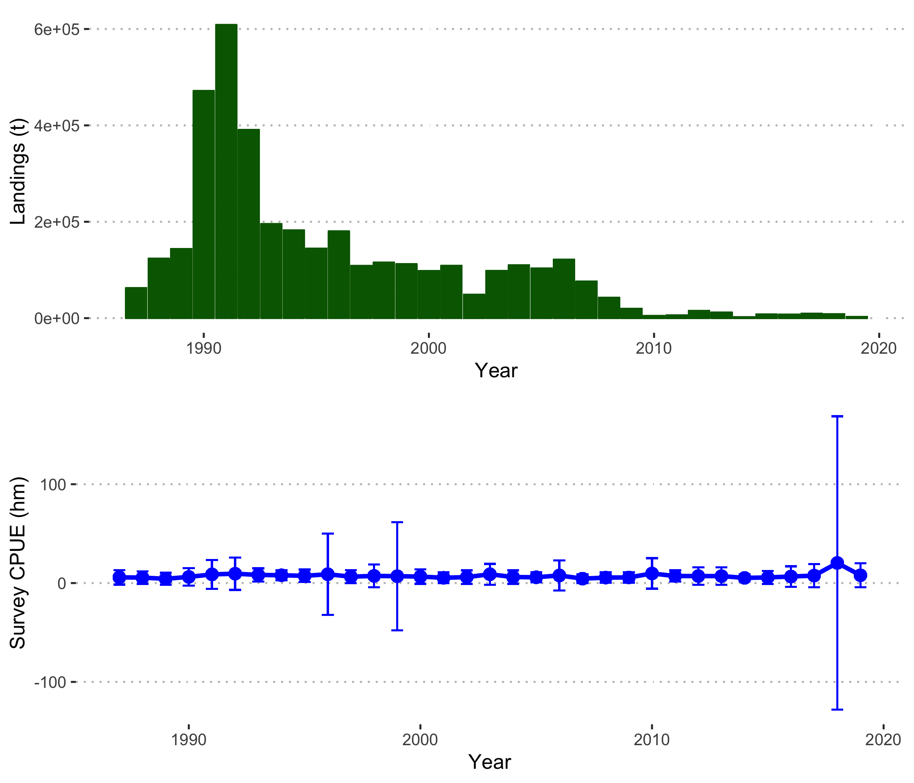
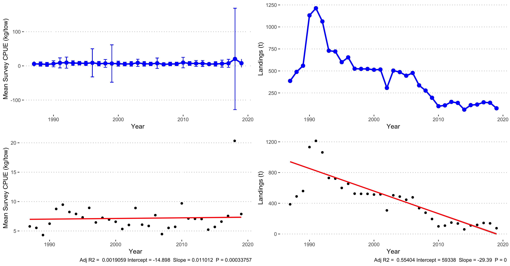
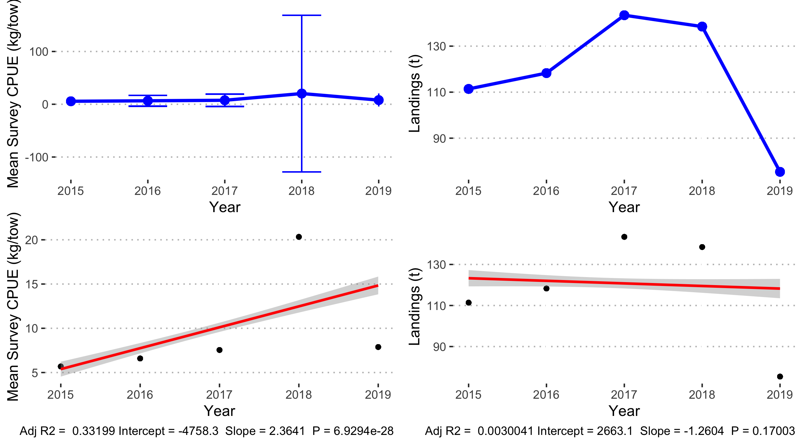
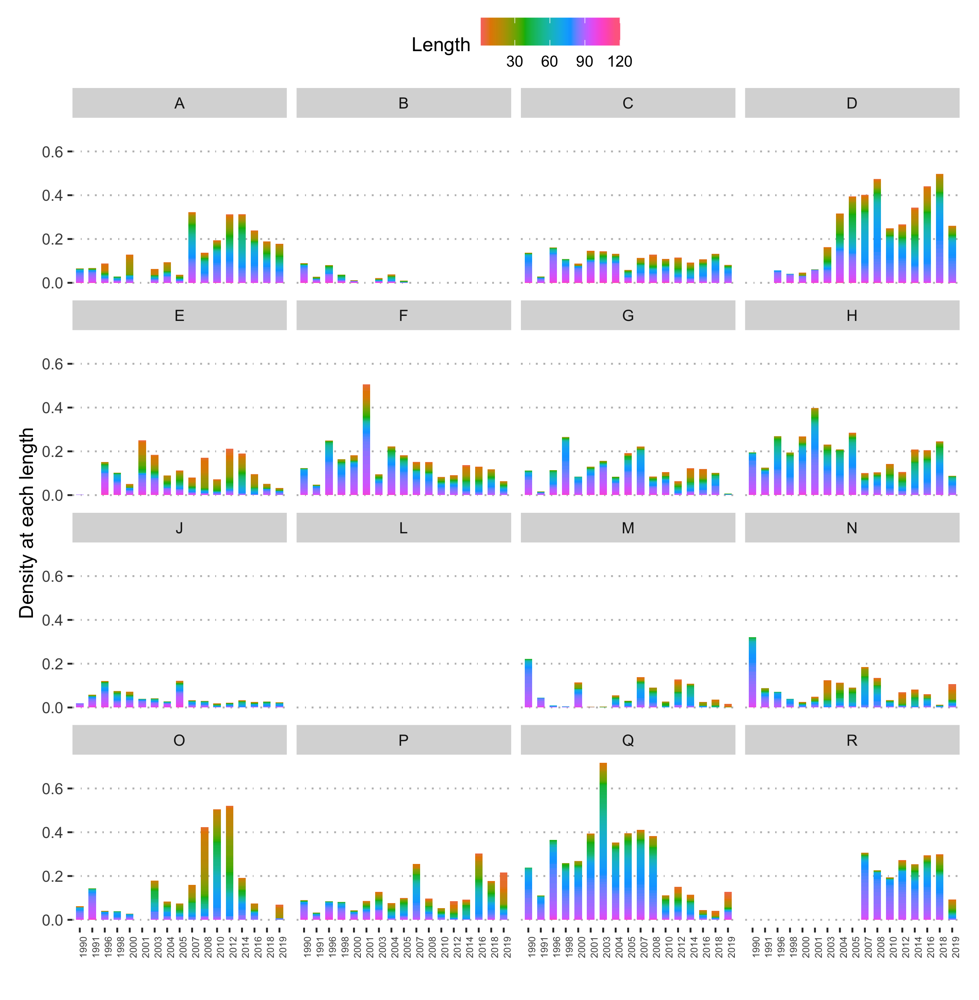

```{r setup, include=FALSE}
knitr::opts_chunk$set(echo = TRUE)
```


# Context

## Scallops fishery

Two scallop species are fished commercially in the Gulf of St. Lawrence: the Sea Scallop (Placopecten magellanicus) and the Iceland Scallop (Chlamys islandica) [@stockass]. Fishing is regulated by a fishing season, and or a limited number of fishing days [@stockass]. Every three years, the scallop stock is assessed to evaluate its status, and to verify whether the management plan and conservation approach need to be adjusted to maintain the resource [@stockass]. This assessment is based on landings, fishing effort, catch per unit effort, size structure, weight of muscle landed and density index from scientific surveys [@stockass].

The scallop fishery is data-limited in the Gulf of St. Lawrence, meaning there is not enough data to conduct a conventional stock assessment. This is where the Data-Limited Methods Toolkit (DLMtool) comes into play.

## DLMtool

The Data-Limited Methods Toolkit ([DLMtool](https://www.datalimitedtoolkit.org/)) is an R package that was conceived to address a widespread problem in fisheries management: conventional stock assessments require a lot of data that is not available for as many as 90% of the world’s fish populations [@Costello517]. Using object-oriented programming and parallel computing, DLMtool models data-limited fisheries under a variety of management strategies that can easily be compared and visualized according to the available information [@DLMtool]. This allows managers to simulate a variety of management scenarios with an evaluation of uncertainty, of the trade-off between how management procedures benefit catch or population stability, and of the potential need to collect additional data. The result is a powerful and customisable simulation and diagnostics tool that synthesizes scenarios of over 114 management procedures to inform management recommendations in a transparent way [@DLMtool]. What began as a collaboration  between the University of British Columbia’s (UBC) Institute for Oceans and Fisheries and the Natural Resources Defense Council (NRDC) has now been used in over 25 fisheries by Fisheries and Oceans Canada, by the National Marine Fisheries Service in the U.S. Mid-Atlantic and Caribbean regions, and by the California Department of Fish & Wildlife, among others [@DLMtool].

\newpage

# Data

For this internship, I had access to three datasets:

- Catches per Unit Effort, including information about the landings, the effort, and the biomass of scallops fished 
- Size structure of the catch (count by scallop length)
- Mortality rates 

# Exploring trends

Before using DLMtool, I first explored the time series in the data provided to me to better understand the system. I first looked at catch data, which contained information about the biomass of the scallop catch per year in each surveyed zone, as well as the effort applied to the catch. After exploring the annual catch trend, I added length-at-capture data to look into the size structure of the catch, which would give insight into the population's structure. I also introduced mortality data into these explorations, to determine how scallop mortality varied (or not) over the sampled period, which would give additional insight into the population's status.

## Catch 







## Length 


## Mortality 


\newpage

# DLMTool

## Creating a Data object

### TACs

## Creating a Fleet object

## Creating an Operating Model

\newpage

# Appendix




\newpage 

# References
