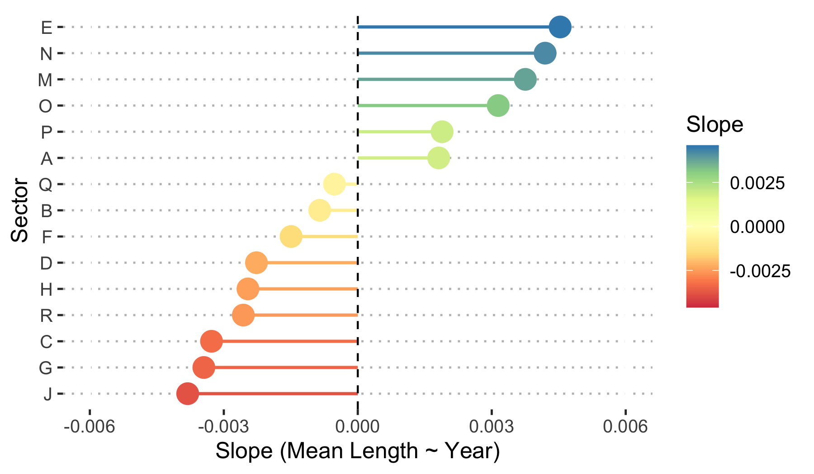
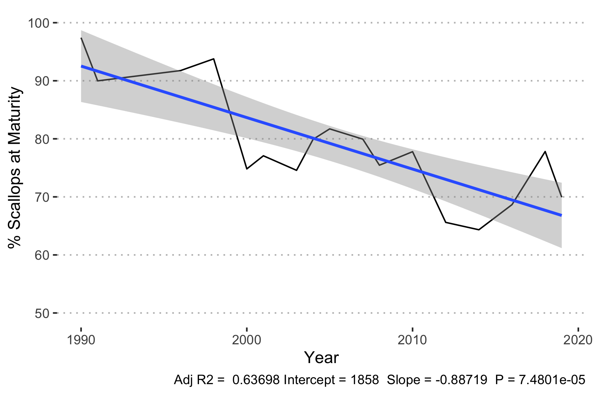
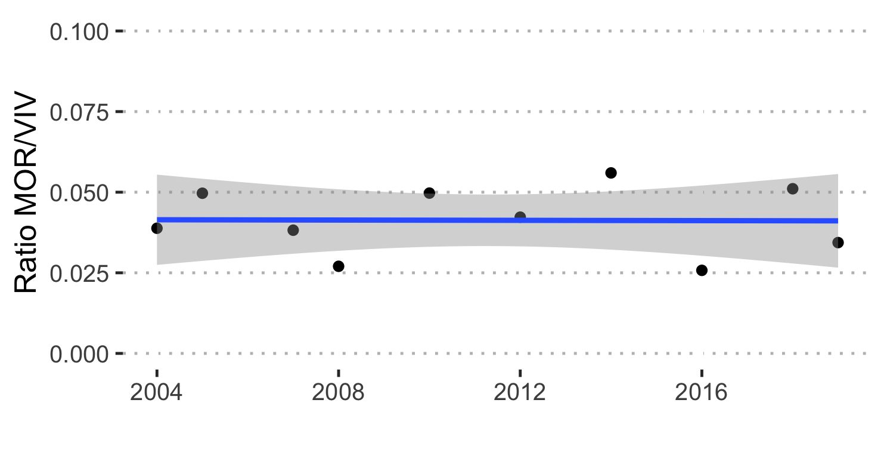

```{r setup, include=FALSE}
knitr::opts_chunk$set(echo = TRUE)
```


# Context

## Scallops fishery

Two scallop species are fished commercially in the Gulf of St. Lawrence: the Sea Scallop (*Placopecten magellanicus*) and the Iceland Scallop (*Chlamys islandica*) [@stockass]. Fishing is regulated by a fishing season, and or a limited number of fishing days [@stockass]. Every three years, the scallop stock is assessed to evaluate its status, and to verify whether the management plan and conservation approach need to be adjusted to maintain the resource [@stockass]. This assessment is based on landings, fishing effort, catch per unit effort, size structure, weight of muscle landed and density index from scientific surveys [@stockass].

The scallop fishery is data-limited in the Gulf of St. Lawrence, meaning there is not enough data to conduct a conventional stock assessment. This is where the Data-Limited Methods Toolkit (DLMtool) comes into play.

## DLMtool

The Data-Limited Methods Toolkit ([DLMtool](https://www.datalimitedtoolkit.org/)) is an R package that was conceived to address a widespread problem in fisheries management: conventional stock assessments require a lot of data that is not available for as many as 90% of the world’s fish populations [@Costello517]. Using object-oriented programming and parallel computing, DLMtool models data-limited fisheries under a variety of management strategies that can easily be compared and visualized according to the available information [@DLMtool]. This allows managers to simulate a variety of management scenarios with an evaluation of uncertainty, of the trade-off between how management procedures benefit catch or population stability, and of the potential need to collect additional data. The result is a powerful and customisable simulation and diagnostics tool that synthesizes scenarios of over 114 management procedures to inform management recommendations in a transparent way [@DLMtool]. What began as a collaboration  between the University of British Columbia’s (UBC) Institute for Oceans and Fisheries and the Natural Resources Defense Council (NRDC) has now been used in over 25 fisheries by Fisheries and Oceans Canada, by the National Marine Fisheries Service in the U.S. Mid-Atlantic and Caribbean regions, and by the California Department of Fish & Wildlife, among others [@DLMtool].

## Objectives

The internship’s main objective is to learn and apply the Data-Limited Methods Toolkit to evaluate scallop stocks. The first objective was to learn the toolkit and describe the main findings in the current report, with the option to a method with high performance to model scallop stocks if time permits. Though time did not permit me to go in much depth with this, I was able to construct some of the objects used in the DLM toolkit workflow to eventually evaluate stocks with greater accuracy and precision. In this report, I will begin by outlining some general trends in scallop catches, length structures, and mortality rates, before describing how I built objects with these datasets using DLMtool. All scripts to generate the figures and results shown in this report are accessible here: **REPO LINK**.

----

# Exploring trends

Before using DLMtool, I first explored the time series in the data provided to me to better understand the system. I first looked at catch data, which contained information about the biomass of the scallop catch per year in each surveyed zone, as well as the effort applied to the catch. After exploring the annual catch trend, I added length-at-capture data to look into the size structure of the catch, which would give insight into the population's structure. I also introduced mortality data into these explorations, to determine how scallop mortality varied (or not) over the sampled period, which would give additional insight into the population's status.

## Catch 

First, I explored the commercial fishery dataset which contained Catches per Unit Effort (CPUE), and data describing the Effort, biomass fished (i.e. Landings), and other information describing each event such as date and location variables. These time series are plotted in Figures 1a and 1b. Though the Survey CPUE time series shows relative stability through time in terms of mean CPUE, there is some variability in the variance in CPUE across sectors, with particularly high variance in the years 2018, 1999, and 1996 (Figure 1a).

Then, I fit a simple linear model to each time series to determine an overall trend through time for each measure (Figure 1c and 1d). While CPUE has remained relatively stable since 1987 (Figure 1c), landings have been steadily decreasing at a rate of -29.39 **tons per year????** since 1987 despite a large increase before 1990 (Figure 1d). 


Though an overview of the whole time series is very helpful to gain an understanding of the broader context of the fishery and how it has been managed, a closer look at recent trends is helpful to evaluate the current status of the fishery (Figure 2). If we "zoom in" to the most recent 5 years, we get a slightly different picture of the Survey CPUE and Landings trends shown above. Notably, we can see that an average increase in Survey CPUE in 2018 (Figures 2a and 2c) was followed by a decrease in landings between 2018 and 2019 (Figures 2b and 2d). 


Both plots and analyses in Figures 1 and 2 were adapted from @refpoint [github.com/MathBoud/DLM.ReferencePoint](https://github.com/MathBoud/DLM.ReferencePoint). The code to reproduce these figures **is in the script ____ in the repo _________**.


## Length 

Though the overall trend is informative, I also had access to a survey of scallop length counts through time, which offer insight into the Gulf population's structure which is not accessible in the overall catch and landings time series explored above. First, I took the weighted mean of scallop length per year, where the weights were the counts of scallops in each length category. As such, the weighted mean represents the mean length of the population for each year, accounting for the abundance of scallops at different lengths. 

To determine the trend in mean length over the time series, I compared a simple linear model of the relationship between mean length and year to two linear mixed models: one with a random effect by sector on the model intercept, and one with a random effect on the slope by sector, to account for differences in the populations between sectors. Though there is some variability in the mean length trend in different sectors, the simple linear model

table describing the models here, and their aic

applied a linear model to these weighted mean lengths, to v (Figure 3). 


If we evaluate the trend in each sector, the slopes differ as such:




Froese length indicators 

Among other things, length surveys provide information about the proportion of the scallop population which has attained maturity, which is an indicator of ____.




## Mortality 

- Mortality rates, subset to the years 2004 to 2019 because the sampling protocol changed just before this period of time.




----

# DLMTool

## Creating a Data object

### TACs

## Creating a Fleet object

## Creating an Operating Model

\newpage 

# References
